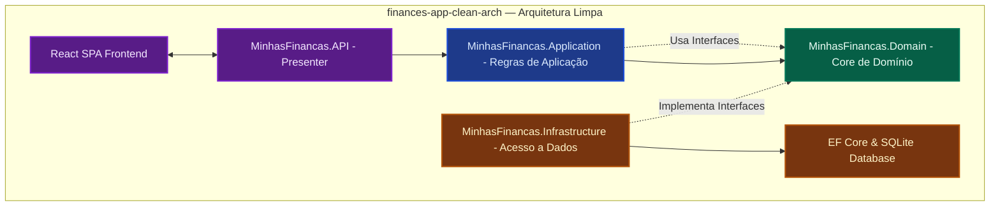
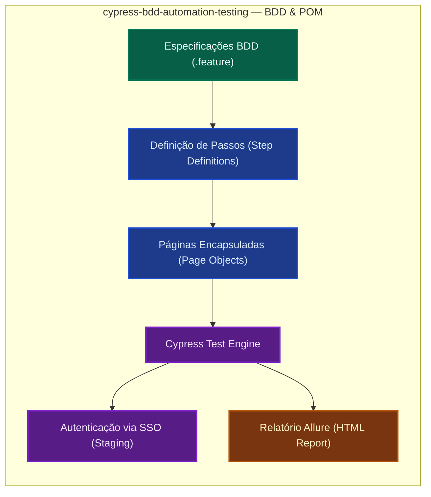
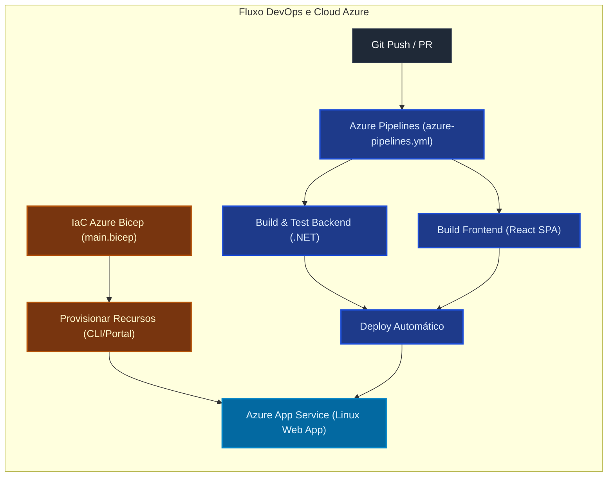

# ✨ PORTFÓLIO DE PROJETOS — DEVS HUB ✨

Seja bem-vindo(a) ao meu portfólio de engenharia de software! Este repositório unifica projetos reais desenvolvidos com foco em **Arquitetura Limpa**, **Segurança**, **Qualidade de Software**, **Testes Automatizados (E2E & Unitários)**, **Testes de Performance** e **Práticas Modernas de DevSecOps/CI/CD**.

---

## 🚀 Tecnologias em Destaque


---

## 📂 Projetos no Repositório

| Projeto | Descrição | Stack Principal | Destaques Técnicos | Link de Acesso |
| :--- | :--- | :--- | :--- | :---: |
| **Finances App (Clean Arch)** | Sistema completo para controle de despesas e receitas domésticas com foco em segurança OWASP. | .NET 9, React, Vite, Tailwind CSS, EF Core, SQLite | Clean Architecture, Injeção de Dependências, Testes unitários/integração (xUnit), Testes E2E (Playwright), Docker Compose | [Acessar Projeto](file:///c:/Projetos/Trampo%20teste/finances-app-clean-arch) |
| **Cypress BDD Automation Testing** | Suíte corporativa de testes automatizados E2E para o portal do aluno. | Cypress, Cucumber (BDD), JavaScript, Allure Reports, Husky | Login via SSO, Injeção de variáveis de ambiente seguras, Relatórios visuais avançados, Execução paralela | [Acessar Projeto](file:///c:/Projetos/Trampo%20teste/cypress-bdd-automation-testing) |
| **k6 Performance Testing** | Simulação de carga e estresse automatizados contra a API REST para validação de latência. | JavaScript (ES6), Grafana k6 | Ramping de usuários virtuais concorrentes, Definição de thresholds de SLA, Monitoramento de latência e taxa de erro | [Acessar Projeto](file:///c:/Projetos/Trampo%20teste/k6-performance-testing) |

---

## 📐 Arquitetura dos Projetos

### 1. Finances App (Clean Architecture)

O design do backend segue os princípios da **Arquitetura Limpa (Clean Architecture)**, isolando as regras de negócios centrais (Domínio) dos detalhes de infraestrutura (Banco de dados) e apresentação (API REST).



### 2. Cypress BDD Automation Testing (POM + BDD)

A suíte de testes do Cypress foi arquitetada utilizando o **Page Object Model (POM)** acoplado com **Cucumber (BDD)** para separar cenários de negócios em linguagem natural dos scripts de assertions.



### 3. Fluxo DevOps & Nuvem (CI/CD Azure DevOps + IaC)

O ecossistema DevOps é orquestrado de forma moderna utilizando pipeline automatizado no Azure Pipelines com provisionamento via código (IaC) com arquivos Bicep:



---

## 🏛️ Estrutura Organizada do Repositório

Esta é a estrutura de diretórios unificada e limpa que organiza todos os projetos sem redundâncias ou arquivos residuais de compilação:

```text
c:/Projetos/Trampo teste/
├── azure-pipelines.yml           # CI/CD Pipeline do Azure DevOps (YAML)
├── finances-app-clean-arch/      # Sistema de Controle de Gastos Residenciais
│   ├── api/                      # Backend .NET 9 Web API
│   │   ├── MinhasFinancas.API/          # Camada de apresentação e controladores
│   │   ├── MinhasFinancas.Application/  # Regras de aplicação (Usecases, DTOs)
│   │   ├── MinhasFinancas.Domain/       # Core de negócios (Entidades puras, Interfaces)
│   │   └── MinhasFinancas.Infrastructure/ # Banco e Acesso a dados (EF Core)
│   ├── web/                      # Frontend SPA React 19 + Vite (Interface do Usuário)
│   ├── data/                     # Pasta do SQLite Local (minhasfinancas.db)
│   ├── tests/                    # Suíte unificada de Garantia de Qualidade (QA)
│   │   ├── backend/              # Testes do C# (Unitários e de Integração com xUnit)
│   │   └── frontend/             # Testes do React (Vitest e E2E Playwright)
│   └── docker-compose.yml        # Orquestrador local da API + Web em containers
│
├── cypress-bdd-automation-testing/ # Automação Cypress para Área do Aluno
│   ├── cypress/                  # Testes BDD (.feature), Definição de passos (Steps) e Page Objects
│   │   ├── e2e/                  # Funcionalidades e fluxos simulados
│   │   └── support/              # Comandos customizados Cypress e configurações
│   ├── package.json              # Dependências e scripts de teste
│   └── cypress.env.example.json  # Modelo para configuração das credenciais SSO
│
├── k6-performance-testing/       # Testes de carga e estresse com Grafana k6
│   ├── load-test.js              # Script k6 de simulação de carga
│   └── README.md                 # Guia de instalação e limiares de aceitação de SLA
│
└── infrastructure-azure/         # Infraestrutura como Código (IaC) para nuvem Azure
    ├── main.bicep                # Definição dos recursos a provisionar no Azure
    └── parameters.json           # Parâmetros de parametrização de deploy do Bicep
```

---

## 🔒 Segurança e Privacidade de Dados (DevSecOps)

Este repositório foi estruturado seguindo rigorosas práticas de segurança da informação para blindar dados corporativos e credenciais confidenciais:

| Recurso Sensível | Localização Original | Status no Git | Estratégia de Segurança |
| :--- | :--- | :--- | :--- |
| **Credenciais de Acesso** | `cypress-bdd-automation-testing/cypress.env.json` | 🚫 **Ignorado** | Excluído do controle de versão. Disponibilizado o template genérico [cypress.env.example.json](file:///c:/Projetos/Trampo%20teste/cypress-bdd-automation-testing/cypress.env.example.json) para preenchimento individual local. |
| **Banco de Dados Local** | `finances-app-clean-arch/api/MinhasFinancas.API/*.db`<br>`finances-app-clean-arch/data/*.db` | 🚫 **Ignorado** | Arquivos SQLite removidos do rastreamento para evitar vazamento de dados de simulações. A aplicação gera bases de dados zeradas na primeira execução. |
| **Relatórios e Mídias** | `cypress-bdd-automation-testing/allure-results/`<br>`cypress-bdd-automation-testing/allure-report/`<br>`cypress/screenshots/`<br>`cypress/videos/` | 🚫 **Ignorado** | Relatórios locais e mídias de falha de teste são ignorados para manter a árvore do repositório leve e sem arquivos gerados dinamicamente. |
| **Variáveis de Ambiente** | `.env`, `.env.local` | 🚫 **Ignorado** | Arquivos de ambiente locais do React/Node.js são excluídos de commits de forma global. |

---

## 🛠️ Como Iniciar Localmente

### Guia Rápido de Execução

| Objetivo | Diretório de Trabalho | Comando | Descrição / Resultado |
| :--- | :--- | :--- | :--- |
| **Rodar Aplicação Finanças** | `finances-app-clean-arch/` | `docker-compose up --build` | Executa o backend (.NET) e frontend (React) em containers. |
| **Acessar API Swagger** | — | — | Acesse `http://localhost:5000/swagger` no navegador com a API rodando. |
| **Acessar Frontend Web** | — | — | Acesse `http://localhost:5173` no navegador. |
| **Instalar Cypress** | `cypress-bdd-automation-testing/` | `npm install` | Instala as dependências necessárias para a suíte de testes de QA. |
| **Configurar Segredos** | `cypress-bdd-automation-testing/` | `cp cypress.env.example.json cypress.env.json` | Cria o arquivo de credenciais local (preencha-o antes de rodar os testes). |
| **Executar Testes Cypress** | `cypress-bdd-automation-testing/` | `npm run test` | Abre o Cypress Test Runner interativo para execução dos cenários. |
| **Executar Teste Carga k6** | `k6-performance-testing/` | `k6 run load-test.js` | Executa o teste completo de estresse e performance da API e valida SLAs. |
| **Executar Teste Rápido k6** | `k6-performance-testing/` | `k6 run load-test.js --vus 1 --duration 1s` | Smoke test de validação rápida com 1 usuário e 1 iteração. |
| **Restauração do Backend C#** | `finances-app-clean-arch/tests/backend/` | `dotnet restore MinhasFinancas.Tests.sln` | Restaura dependências NuGet do backend de testes. |
| **Rodar Testes de Unidade C#** | `finances-app-clean-arch/tests/backend/` | `dotnet test MinhasFinancas.UnitTests/MinhasFinancas.UnitTests.csproj` | Roda os testes unitários do backend .NET. |

---

*Desenvolvido com excelência técnica para fins de portfólio de engenharia. Dúvidas ou sugestões, sinta-se à vontade para abrir uma issue!*
