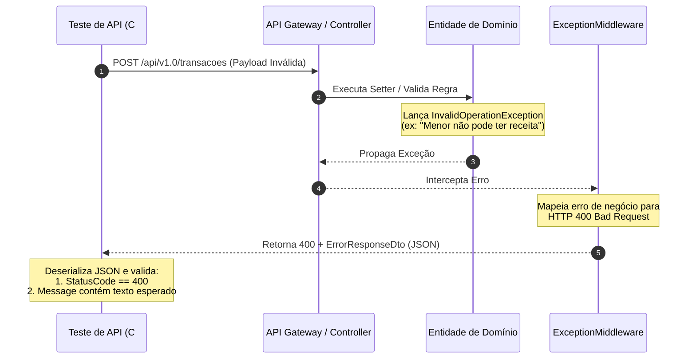

# Testes — Minhas Finanças

Repositório **somente de testes** para o sistema de controle de gastos residenciais. O código da aplicação **não** faz parte deste repositório e **não deve ser alterado** durante a execução dos testes.

## Pré-requisitos

| Camada | Ferramentas |
|--------|-------------|
| Back-end | [.NET 9 SDK](https://dotnet.microsoft.com/download) |
| Front-end (unit) | Node.js 20+ e npm |
| E2E | Aplicação rodando (Docker Compose recomendado) |

### Código-fonte da aplicação

A aplicação e a suíte de testes estão unificadas nesta mesma pasta do projeto (`finances-app-clean-arch`), com a seguinte estrutura:

```text
finances-app-clean-arch/
├── api/             ← Backend .NET 9 Web API
├── web/             ← Frontend React + TypeScript
├── data/            ← SQLite Database (local)
└── tests/           ← Testes (este diretório)
```

O caminho é resolvido automaticamente em `backend/Directory.Build.props` (`AppRoot`).

## Pirâmide de testes

```
        ┌─────────────┐
        │  E2E (few)  │  Playwright — fluxos críticos na UI + API viva
        ├─────────────┤
        │ Integração  │  xUnit + WebApplicationFactory — HTTP + SQLite
        ├─────────────┤
        │ Unitários   │  xUnit — domínio e serviços (NSubstitute)
        └─────────────┘
```

| Nível | Pasta | Foco |
|-------|-------|------|
| Unitários (.NET) | `backend/MinhasFinancas.UnitTests` | `Categoria.PermiteTipo`, idade de `Pessoa`, `TransacaoService` |
| Integração (.NET) | `backend/MinhasFinancas.IntegrationTests` | Endpoints REST e persistência |
| Unitários (React) | `frontend/unit` | Schemas Zod e regras de negócio documentadas |
| E2E | `frontend/e2e` | Jornadas na UI com Playwright |

### Justificativa das escolhas

- **Unitários no domínio**: regras puras (`PermiteTipo`, `EhMaiorDeIdade`) são rápidas, determinísticas e baratas.
- **Unitários no serviço**: `TransacaoService` orquestra entidades com setters internos; mocks isolam persistência.
- **Integração via API**: valida pipeline completo (controller → service → EF) sem modificar a aplicação.
- **Vitest no front**: valida contratos de formulário e documenta lacunas de validação.
- **Playwright**: confirma comportamento percebido pelo usuário e integração real front + back.

## Como executar

### 1. Subir a aplicação (para E2E)

Na pasta da aplicação:

```bash
docker-compose up --build
```

- API: http://localhost:5000/swagger  
- Web: http://localhost:5173  

### 2. Testes unitários e integração (.NET)

```bash
cd backend
dotnet restore MinhasFinancas.Tests.sln
dotnet test MinhasFinancas.Tests.sln
```

Somente unitários:

```bash
dotnet test MinhasFinancas.UnitTests/MinhasFinancas.UnitTests.csproj
```

Somente integração:

```bash
dotnet test MinhasFinancas.IntegrationTests/MinhasFinancas.IntegrationTests.csproj
```

### 3. Testes unitários front-end (Vitest)

```bash
cd frontend
npm install
npm run test:unit
```

### 4. Testes E2E (Playwright)

Com a aplicação no ar:

```bash
cd frontend
npx playwright install chromium
npm run test:e2e
```

Variáveis opcionais:

```bash
WEB_BASE_URL=http://localhost:5173 API_BASE_URL=http://localhost:5000/api/v1.0 npm run test:e2e
```

## Regras de negócio cobertas

| Regra | Unit (.NET) | Integração | Front (Vitest) | E2E |
|-------|:-----------:|:----------:|:--------------:|:---:|
| Menor não pode ter receitas | ✓ | ✓ | ✓ | parcial |
| Categoria conforme finalidade | ✓ | ✓ | ✓ | — |
| Exclusão em cascata (pessoa) | — | ✓ | — | — |

## 🔍 Governança de Validação de API (Status Codes & Payloads)

Nossa suíte de testes de API (Integração C# e E2E Playwright) valida rigorosamente não apenas os códigos de status HTTP, mas também a integridade das payloads de envio (requests) e retorno (responses) das seguintes formas:

### 1. Fluxo de Validação de Violação de Negócio (ex: 400 Bad Request)

Quando uma regra de domínio é violada, a exceção é capturada globalmente, formatada e validada pelo teste:



### 2. Matriz de Cobertura de Status Codes & Payloads

Abaixo está o mapeamento dos endpoints da aplicação e a respectiva validação em testes automatizados:

| Controller | Ação / Rota | Método | Status Codes Validados | Validação de Request | Validação de Response | Suíte de Testes |
| :--- | :--- | :---: | :---: | :---: | :---: | :---: |
| **Pessoas** | `GET /pessoas` | `GET` | `200 OK` | — | Estrutura de Contrato (Zod) | Playwright E2E |
| | `GET /pessoas/{id}` | `GET` | `404 NotFound` | — | Payload de erro | C# Integration |
| | `POST /pessoas` | `POST` | `201 Created`, `400 BadRequest` | DataAnnotations (Nome vazio) | ID válido + Correspondência de Campos | C# Integration |
| | `PUT /pessoas/{id}` | `PUT` | `404 NotFound` | DTO completo | Payload de erro | C# Integration |
| | `DELETE /pessoas/{id}` | `DELETE` | `204 NoContent`, `404 NotFound` | — | — | C# Integration / Playwright |
| **Categorias** | `GET /categorias/{id}` | `GET` | `404 NotFound` | — | Payload de erro | C# Integration |
| | `POST /categorias` | `POST` | `201 Created`, `400 BadRequest` | DataAnnotations (Descrição vazia) | ID válido + Correspondência de Campos | C# Integration |
| **Transações** | `GET /transacoes/{id}` | `GET` | `404 NotFound` | — | Payload de erro | C# Integration |
| | `POST /transacoes` | `POST` | `201 Created`, `400 BadRequest` | DataAnnotations (Valor zero) | ID válido + Correspondência (Zod & C#) | C# Integration / Playwright |
| **Totais** | `GET /totais/pessoas` | `GET` | `200 OK` | Filtros na query | Paginação e Estrutura `PagedResult<T>` | C# Integration / k6 |
| | `GET /totais/categorias` | `GET` | `200 OK` | Filtros na query | Paginação e Estrutura `PagedResult<T>` | C# Integration / k6 |
| **Rate Limit** | Global | `ANY` | `429 TooManyRequests` | Loop de 120 chamadas rápidas | Código HTTP 429 | C# Integration |

### 3. Estruturas das Payloads de Resposta Validadas

#### Contrato de Erro Comum (`ErrorResponseDto`)
Mapeia respostas de exceções de negócios tratadas globalmente:
```json
{
  "StatusCode": 400,
  "Message": "Menores de 18 anos não podem registrar receitas.",
  "Detailed": "Menores de 18 anos não podem registrar receitas."
}
```

#### Contrato de Validação de Input (`ValidationProblemDetails`)
Retornado pelo ASP.NET Core automaticamente em falhas de DataAnnotations (400 Bad Request):
```json
{
  "type": "https://tools.ietf.org/html/rfc9110#section-15.5.1",
  "title": "One or more validation errors occurred.",
  "status": 400,
  "errors": {
    "Nome": [
      "Nome é obrigatório."
    ]
  }
}
```

## Bugs documentados

Detalhes em [`docs/bugs/`](docs/bugs/):

| ID | Resumo |
|----|--------|
| [BUG-001](docs/bugs/BUG-001-exclusao-cascata-pessoa.md) | Exclusão em cascata não configurada no EF |
| [BUG-002](docs/bugs/BUG-002-erro-500-regras-negocio.md) | Regras violadas retornam HTTP 500 |
| [BUG-003](docs/bugs/BUG-003-filtro-categoria-formulario.md) | Formulário não filtra categorias por tipo |
| [BUG-004](docs/bugs/BUG-004-schema-sem-regras-negocio.md) | Schema Zod sem regras de negócio |
| [BUG-005](docs/bugs/BUG-005-bypass-validacao-entidade.md) | Ordem de inicialização permite bypass de validação |
| [BUG-006](docs/bugs/BUG-006-erro-logica-formulario-categoria.md) | Crash no formulário ao selecionar categoria (Resolvido) |

## CI (GitHub Actions)

Workflow em [`.github/workflows/ci.yml`](.github/workflows/ci.yml). No CI, a aplicação precisa estar disponível como checkout adicional ou artefato — veja comentários no workflow.

## Estrutura do repositório de testes

```text
tests/
├── README.md                  # Guia de execução e documentação geral de testes
├── docs/bugs/                 # Relatórios detalhados de bugs encontrados na aplicação
├── backend/                   # Camada de Testes de Backend (.NET 9 / xUnit)
│   ├── MinhasFinancas.Tests.sln
│   ├── MinhasFinancas.UnitTests/         # Testes Unitários: Regras puras de domínio e serviços
│   └── MinhasFinancas.IntegrationTests/  # Testes de Integração: Controllers, pipelines e persistência EF Core
├── frontend/                  # Camada de Testes de Frontend (React)
│   ├── unit/                  # Testes Unitários com Vitest: Schemas Zod, validadores e lógica pura do front
│   └── e2e/                   # Testes End-to-End com Playwright: Jornadas reais de usuário na UI integrada com a API
└── .github/workflows/         # Pipeline CI no GitHub Actions para automatizar a execução dos testes
```

