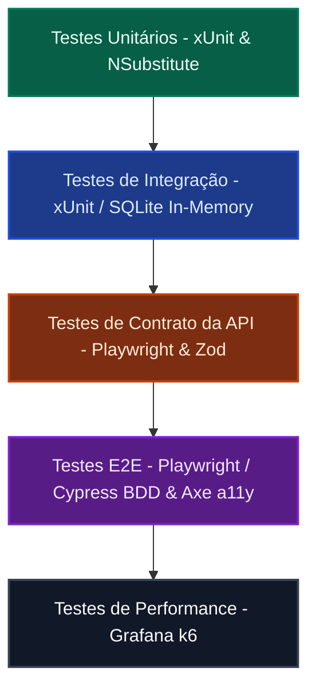
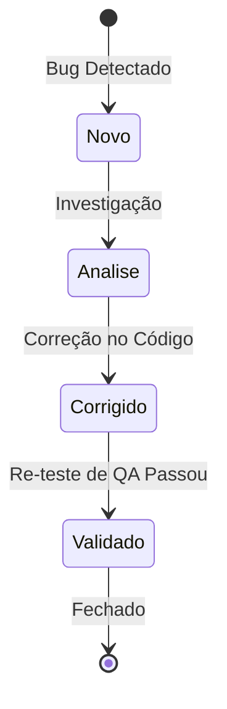

# 🏛️ ESTRATÉGIA GLOBAL DE GARANTIA DE QUALIDADE (QA)

Este documento descreve a governança de qualidade, arquitetura de testes e estratégias aplicadas ao ecossistema do **Finances App** e demais projetos correlacionados. Ele serve como o guia estratégico para garantir a estabilidade, segurança e manutenibilidade da entrega contínua.

---

## 🎯 1. Objetivos da Qualidade de Software

Nossa estratégia baseia-se em quatro pilares fundamentais:
1. **Feedback Rápido (Shift-Left):** Descobrir falhas o mais próximo possível da escrita do código (unitários, estáticos, mutação).
2. **Prevenção de Regressões:** Garantir que novas funcionalidades não quebrem regras de negócio consolidadas.
3. **Acessibilidade & Inclusão (a11y):** Garantir que a plataforma seja usável por qualquer pessoa, atendendo a critérios de acessibilidade legais e de experiência do usuário.
4. **Resiliência e Segurança:** Validação constante contra a OWASP Top 10 (cabeçalhos de segurança, injeções, vazamentos) e estabilidade sob carga.

---

## 📐 2. Pirâmide de Testes e Distribuição de Esforço

Adotamos uma abordagem balanceada seguindo a pirâmide de testes adaptada para a complexidade da aplicação:

### Detalhamento por Camada:
*   **Testes Unitários (C# - xUnit & NSubstitute):** Validam a lógica pura de domínio (`EhMaiorDeIdade`, validação de regras de categoria, etc.). Têm execução em milissegundos e são executados a cada commit local.
*   **Testes de Integração (C# - WebApplicationFactory):** Validam a integração com o banco de dados SQLite real, resolvendo dependências reais da aplicação e testando middlewares como a sanitização global de exceções e persistência de exclusão em cascata.
*   **Testes de Contrato (Playwright & Zod):** Validam a consistência das payloads trafegadas entre o Frontend e o Backend. Capturam desvios de esquema (Schema Drift) sem a necessidade de testes funcionais caros.
*   **Testes E2E (Playwright & Cypress):** Validam as jornadas completas de usuário de ponta a ponta (ex: fluxo de bloqueio de receita para menores via UI).
*   **Testes de Acessibilidade (Playwright & Axe-Core):** Varredura automática das páginas renderizadas para verificar conformidade com as diretrizes do WCAG 2.1 AA.
*   **Testes de Regressão Visual (Playwright Screenshots):** Comparações pixel-a-pixel da interface para validar se alterações de CSS/Tailwind corromperam o layout do sistema.
*   **Testes de Performance (k6):** Executados para validar latência sob picos de usuários concorrentes e garantir cumprimento de SLAs.

---

## ⚡ 3. Teste Baseado em Risco (Risk-Based Testing - RBT)

Para otimizar o tempo de execução e foco dos testes, avaliamos as áreas da aplicação de acordo com o impacto de falha e a probabilidade de ocorrência:

| Componente/Funcionalidade | Impacto | Probabilidade | Nível de Risco | Estratégia de Teste Direcionada |
| :--- | :---: | :---: | :---: | :--- |
| **Cálculo de Totais & Saldos** | Crítico | Médio | **Alto** | Cobertura massiva de testes unitários + testes de integração de API. |
| **Exclusão de Pessoa & Transações** | Crítico | Baixo | **Médio** | Testes de integração cobrindo transação e exclusão em cascata no SQLite. |
| **Regras de Menores de Idade** | Alto | Médio | **Médio** | Testes de negócio funcionais ponta a ponta na UI (Playwright) e validações no Domínio. |
| **Design e Layout da UI** | Médio | Alto | **Médio** | Regressão visual automatizada com screenshots nas páginas principais. |
| **Limitação de Requisições (Rate Limit)** | Médio | Baixo | **Baixo** | Validado através de testes de integração e smoke tests de performance (k6). |

---

## 🐛 4. Governança e Ciclo de Vida de Defeitos

Todos os bugs identificados durante a execução de testes exploratórios ou automatizados são registrados usando um padrão rigoroso de documentação em Markdown na pasta `tests/docs/bugs/`.

### Fluxo de Estados do Defeito:

### Padrão de Report de Bug:
*   **ID do Bug:** Exemplo `BUG-001`.
*   **Resumo:** O que falha e em quais condições.
*   **Severidade:** Crítica, Alta, Média ou Baixa.
*   **Passos para Reproduzir:** Sequência exata de passos.
*   **Resultado Esperado vs. Obtido.**
*   **Evidências:** Logs anexados e screenshots ou gravações.

---

## 🧪 5. Eficácia de Testes com Mutation Testing

Para comprovar que nossa suíte de testes realmente protege a aplicação, configuramos o **Stryker.NET** para introduzir "mutantes" (bugs sintéticos) no código de produção.
*   **Métrica Alvo:** Manter um score de mutação superior a **80%** no domínio central.
*   Se um mutante sobrevive (ou seja, o código de produção foi alterado e nenhum teste falhou), o time de engenharia de qualidade atua inserindo asserções mais estritas para matar o mutante.
